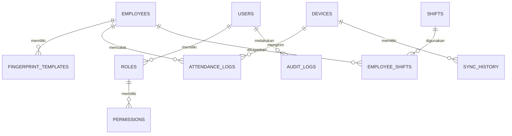

# Skema Basis Data

Dokumen ini menjelaskan struktur basis data, tabel, kolom, dan hubungan antar entitas (ER diagram) untuk sistem Fingerprint Attendance.

## Entity Relationship Diagram (ERD)

## Definisi Tabel

### 1. Karyawan (`employees`)
Tabel utama yang menyimpan data profil karyawan.

| Kolom | Tipe | Deskripsi |
| :--- | :--- | :--- |
| `id` | `UUID` | Primary Key |
| `nik` | `VARCHAR(50)` | Nomor Induk Karyawan (Unique) |
| `nama` | `VARCHAR(200)` | Nama Lengkap |
| `departemen` | `VARCHAR(100)` | Nama Departemen |
| `jabatan` | `VARCHAR(100)` | Posisi/Jabatan |
| `status` | `ENUM` | `aktif`, `nonaktif` |
| `created_at` | `TIMESTAMP` | Waktu pendaftaran |
| `updated_at` | `TIMESTAMP` | Waktu pembaruan terakhir |

### 2. Log Absensi (`attendance_logs`)
Menyimpan setiap pukulan (clock-in/out) dari mesin fingerprint.

| Kolom | Tipe | Deskripsi |
| :--- | :--- | :--- |
| `id` | `UUID` | Primary Key |
| `employee_id` | `UUID` | Foreign Key ke `employees` |
| `device_id` | `UUID` | Foreign Key ke `devices` |
| `timestamp` | `TIMESTAMP` | Waktu absensi tercatat di mesin |
| `verify_type` | `INT` | 0=Password, 1=Sidik Jari, 15=Wajah |
| `in_out_mode` | `INT` | 0=Check-In, 1=Check-Out, 2=Break-Out, 3=Break-In |
| `created_at` | `TIMESTAMP` | Waktu data masuk ke server |

### 3. Perangkat (`devices`)
Konfigurasi mesin fingerprint yang terhubung.

| Kolom | Tipe | Deskripsi |
| :--- | :--- | :--- |
| `id` | `UUID` | Primary Key |
| `name` | `VARCHAR(100)` | Nama Identitas Mesin |
| `serial_number`| `VARCHAR(100)` | Nomor Seri Mesin (Unique) |
| `ip_address` | `VARCHAR(15)` | IP Address di jaringan lokal |
| `port` | `INT` | Port koneksi (Default: 4370) |
| `comm_key` | `VARCHAR(50)` | Password komunikasi mesin (Default: 0) |
| `status` | `ENUM` | `online`, `offline`, `syncing`, `error` |
| `last_sync` | `TIMESTAMP` | Waktu sinkronisasi terakhir |

### 4. Jadwal Kerja (`shifts`)
Master data jam kerja.

| Kolom | Tipe | Deskripsi |
| :--- | :--- | :--- |
| `id` | `UUID` | Primary Key |
| `nama` | `VARCHAR(100)` | Nama Shift (misal: Shift Pagi) |
| `jam_masuk` | `TIME` | Waktu mulai kerja |
| `jam_pulang` | `TIME` | Waktu selesai kerja |
| `toleransi` | `INT` | Menit toleransi keterlambatan |
| `hari_kerja` | `ARRAY` | Index hari aktif (0=Minggu, dst) |
| `is_active` | `BOOLEAN` | Status aktif shift |

### 5. Penugasan Shift (`employee_shifts`)
Menghubungkan karyawan dengan jadwal kerja tertentu.

| Kolom | Tipe | Deskripsi |
| :--- | :--- | :--- |
| `id` | `UUID` | Primary Key |
| `employee_id` | `UUID` | Foreign Key ke `employees` |
| `shift_id` | `UUID` | Foreign Key ke `shifts` |
| `tanggal_mulai`| `DATE` | Awal berlakunya shift |
| `tanggal_selesai`| `DATE` | Akhir berlakunya shift (opsional) |

### 6. Pengaturan Sistem (`system_settings`)
Konfigurasi global aplikasi.

| Kolom | Tipe | Deskripsi |
| :--- | :--- | :--- |
| `id` | `UUID` | Primary Key |
| `key` | `VARCHAR` | Nama Pengaturan (Unique) |
| `value` | `TEXT` | Nilai Pengaturan (JSON/String) |
| `type` | `VARCHAR` | Tipe data nilai |

## Indeks Penting
- `idx_attendance_emp_time`: (`employee_id`, `timestamp`) untuk kalkulasi cepat laporan.
- `idx_attendance_dev_time`: (`device_id`, `timestamp`) untuk pemantauan beban mesin.
- `idx_employee_nik`: (`nik`) untuk pencarian cepat data karyawan.
